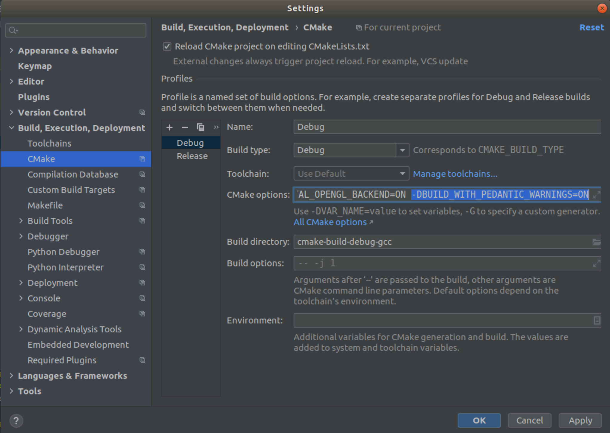

# Scistats

> Descriptive Statistics and Hypothesis Tests

[](https://alandefreitas.github.io/scistats/)

> ** This is work in progress!**

<br/>

Statistics help us analyze and interpret data. High-performance statistical algorithms help us analyze and interpret a lot of data. Most environments provide convenient helper functions to calculate basic statistics. Scistats aims to provide high-performance statistical algorithms with an easy and familiar interface. All algorithms can run sequentially or in parallel, depending on how much data you have.

<br/>

<!-- https://gist.github.com/jbroadway/2836900 -->
<!-- START doctoc generated TOC please keep comment here to allow auto update -->
<!-- DON'T EDIT THIS SECTION, INSTEAD RE-RUN doctoc TO UPDATE -->
<details>
<summary>Table of Contents</summary>

- [Examples](#examples)
  - [Descriptive statistics](#descriptive-statistics)
  - [Probability](#probability)
  - [Hypothesis Testing](#hypothesis-testing)
  - [Bayesian statistics](#bayesian-statistics)
  - [Data processing](#data-processing)
- [Roadmap](#roadmap)
- [Integration](#integration)
  - [Build from Source](#build-from-source)
  - [CMake targets](#cmake-targets)
  - [Other build systems](#other-build-systems)
  - [Contributing](#contributing)
  - [Contributors](#contributors)

</details>
<!-- END doctoc generated TOC please keep comment here to allow auto update -->

## Examples

The examples assume we are working in the `scistats` namespace.

### Descriptive statistics

#### Central tendency

With ranges:

```cpp
mean(x); 
```

With iterators:

```cpp
mean(x.begin(), x.end()); 
```

You can run any algorithm in parallel by changing the execution policy:

```cpp
mean(execution::seq, x);
mean(execution::par, x);
```

If no execution policy is provided, scistats will infer the best execution policy according to the input data.

#### Dispersion

> Work in progress

#### Correlation

> Work in progress

### Probability

> Work in progress

### Hypothesis Testing

> Work in progress

### Bayesian statistics

> Work in progress

### Data processing

> Work in progress

#### Outliers

> Work in progress

## Roadmap

* Descriptive statistics <sup> [1](https://docs.python.org/3/library/statistics.html) </sup> <sup> [2](https://docs.scipy.org/doc/scipy/reference/stats.html) </sup> <sup> [3](https://www.mathworks.com/help/matlab/descriptive-statistics.html) </sup>
* Probability distributions <sup> [1](https://www.mathworks.com/help/stats/probability-distributions-1.html) </sup>
* Hypothesis Tests <sup> [1](https://www.mathworks.com/help/stats/hypothesis-tests-1.html) </sup>
    * Basic tests <sup> [1](https://machinelearningmastery.com/statistical-hypothesis-tests-in-python-cheat-sheet/) </sup> <sup> [2](https://www.mathworks.com/help/stats/hypothesis-tests-1.html) </sup>
    * Anova <sup> [1](https://www.mathworks.com/help/stats/analysis-of-variance-anova-1.html) </sup>
    * Bayeasian Statistics <sup> [1](https://www.mathworks.com/help/stats/examples/bayesian-analysis-for-a-logistic-regression-model.html) </sup>
* Data processing <sup> [1](https://www.mathworks.com/help/matlab/preprocessing-data.html) </sup>
    * Outliers
    * Curve fitting

## Integration

### Build from Source

#### Dependencies

* C++17
* CMake 3.14+

<details>
    <summary>Instructions: Linux/Ubuntu/GCC</summary>

Check your GCC version:

```bash
g++ --version
```

The output should be something like:

```console
g++-8 (Ubuntu 8.4.0-1ubuntu1~18.04) 8.4.0
```

If you see a version before GCC-8, update it with

```bash
sudo apt update
sudo apt install gcc-8
sudo apt install g++-8
```

To update to any other version, like GCC-9 or GCC-10:

```bash
sudo apt install build-essential
sudo add-apt-repository ppa:ubuntu-toolchain-r/test
sudo apt-get update
sudo apt install g++-10
```

Once you installed a newer version of GCC, you can link it to `update-alternatives`. For instance, if you have GCC-7 and GCC-10, you can link them with:

```bash
sudo update-alternatives --install /usr/bin/gcc gcc /usr/bin/gcc-7 7
sudo update-alternatives --install /usr/bin/g++ g++ /usr/bin/g++-7 7
sudo update-alternatives --install /usr/bin/gcc gcc /usr/bin/gcc-10 10
sudo update-alternatives --install /usr/bin/g++ g++ /usr/bin/g++-10 10
```

You can now use `update-alternatives` to set your default `gcc` and `g++` to a more recent version:

```bash
update-alternatives --config g++
update-alternatives --config gcc
```

Also check your CMake version:

```bash
cmake --version
```

If it's older than CMake 3.14, update it with

```bash
sudo apt upgrade cmake
```

or download the most recent version from [cmake.org](https://cmake.org/).

[Later](#build-the-examples) when running CMake, make sure you are using GCC-8 or higher by appending the following options:

```bash
-DCMAKE_C_COMPILER=/usr/bin/gcc-8 -DCMAKE_CXX_COMPILER=/usr/bin/g++-8
```

</details>

<details>
    <summary>Instructions: Mac Os/Clang</summary>

Check your Clang version:

```bash
clang --version
```

The output should have something like

```console
Apple clang version 11.0.0 (clang-1100.0.33.8)
```

If you see a version before Clang 11, update XCode in the App Store or update clang with homebrew. 

Check your CMake version:

```bash
cmake --version
```

If it's older than CMake 3.14, update it with

```bash
sudo brew upgrade cmake
```

or download the most recent version from [cmake.org](https://cmake.org/).

If the last command fails because you don't have [Homebrew](https://brew.sh) on your computer, you can install it with

```bash
/bin/bash -c "$(curl -fsSL https://raw.githubusercontent.com/Homebrew/install/master/install.sh)"
```

or you can follow the instructions in [https://brew.sh](https://brew.sh).

</details>

<details>
    <summary>Instructions: Windows/MSVC</summary>

* Make sure you have a recent version of [Visual Studio](https://visualstudio.microsoft.com)
* Download Git from [https://git-scm.com/download/win](https://git-scm.com/download/win) and install it
* Download CMake from [https://cmake.org/download/](https://cmake.org/download/) and install it

</details>

You can see the dependencies in [`source/CMakeLists.txt`](source/CMakeLists.txt).

#### Build the Examples

This will build the examples in the `build/examples` directory:

```bash
mkdir build
cd build
cmake .. -DCMAKE_BUILD_TYPE=Release -DCMAKE_CXX_FLAGS="-O2"
cmake --build . --parallel 2 --config Release
```

* Replace `--parallel 2` with `--parallel <number of cores in your machine>`
* On Windows, replace `-O2` with `/O2` 
* On Linux, you might need `sudo` for this last command

#### Installing Scistats from Source

This will install Scistats on your system:

```bash
mkdir build
cd build
cmake .. -DCMAKE_BUILD_TYPE=Release -DCMAKE_CXX_FLAGS="-O2" -DBUILD_EXAMPLES=OFF -DBUILD_TESTS=OFF 
cmake --build . --parallel 2 --config Release
cmake --install .
```

* Replace `--parallel 2` with `--parallel <number of cores in your machine>` 
* On Windows, replace `-O2` with `/O2` 
* On Linux, you might need `sudo` for this last command

### CMake targets

#### Find it as a CMake Package

If you have the library installed, you can call

```cmake
find_package(Scistats)
```

from your CMake build script. 

When creating your executable, link the library to the targets you want:

```
add_executable(my_target main.cpp)
target_link_libraries(my_target PUBLIC scistats)
```

Add this header to your source files:

```cpp
#include <scistats/scistats.h>
```

#### Use it as a CMake subdirectory

You can use Scistats directly in CMake projects without installing it. Check if you have [Cmake](http://cmake.org) 3.14+ installed:

```bash
cmake -version
```

Clone the whole project
 
```bash
git clone https://github.com/alandefreitas/scistats/
```

and add the subdirectory to your CMake project:

```cmake
add_subdirectory(scistats)
```

When creating your executable, link the library to the targets you want:

```
add_executable(my_target main.cpp)
target_link_libraries(my_target PUBLIC scistats)
```

You can now add the [scistats headers](#examples) to your source files.

However, it's always recommended to look for Scistats with `find_package` before including it as a subdirectory. Otherwise, we can get [ODR errors](https://en.wikipedia.org/wiki/One_Definition_Rule) in larger projects. 

#### CMake with Automatic Download

Check if you have [Cmake](http://cmake.org) 3.14+ installed:

```bash
cmake -version
```

Install [CPM.cmake](https://github.com/TheLartians/CPM.cmake) and then:

```cmake
CPMAddPackage(
    NAME scistats
    GITHUB_REPOSITORY alandefreitas/scistats
    GIT_TAG origin/master # or whatever tag you want
)
# ...
target_link_libraries(my_target PUBLIC scistats)
```

You can now add the [scistats headers](#examples) to your source files.

However, it's always recommended to look for Scistats with `find_package` before including it as a subdirectory. You can use:

```
option(CPM_USE_LOCAL_PACKAGES "Try `find_package` before downloading dependencies" ON)
```

to let CPM.cmake do that for you. Otherwise, we can get [ODR errors](https://en.wikipedia.org/wiki/One_Definition_Rule) in larger projects.

### Other build systems

If you want to use it in another build system you can either install the library (Section [*Binary Packages*](#binary-packages) or Section [Installing Scistats from Source](#installing-scistats-from-source) or you have to somehow rewrite the build script.

If you want to rewrite the build script, your project needs to 1) include the headers, and 2) link with the dependencies described in [`source/CMakeLists.txt`](source/CMakeLists.txt).

### Contributing

There are many ways in which you can contribute to this library:

* Testing the library in new environments
* Contributing with interesting examples
* Contributing with new statistics
* Finding problems in this documentation
* Finding bugs in general
* Whatever idea seems interesting to you

If contributing with code, please leave the pedantic mode ON (`-DBUILD_WITH_PEDANTIC_WARNINGS=ON`), and don't forget cppcheck and clang-format.

<details markdown="1">
    <summary>Example: CLion</summary>
    

</details>

If contributing to the documentation, please edit [`README.md`](README.md) directly, as the files in [`./docs`](./docs) are automatically generated with [mdsplit](https://github.com/alandefreitas/mdsplit).

### Contributors

<!-- readme: collaborators,contributors -start --> 
<table>
<tr>
    <td align="center">
        <a href="https://github.com/alandefreitas">
            
            <br />
            <sub><b>Alan De Freitas</b></sub>
        </a>
    </td>
    <td align="center">
        <a href="https://github.com/rcpsilva">
            
            <br />
            <sub><b>Rcpsilva</b></sub>
        </a>
    </td></tr>
</table>
<!-- readme: collaborators,contributors -end -->

