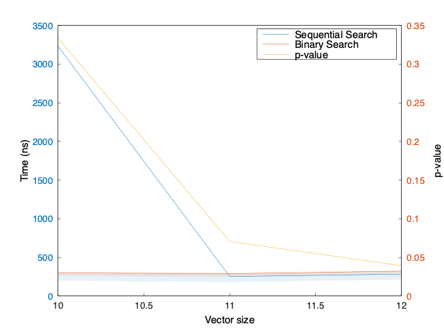

# Scistats

> High-Performance Descriptive Statistics and Hypothesis Tests in C++20

 

Statistics help us analyze and interpret data. High-performance statistical algorithms help us analyze and interpret a lot of data. Most environments provide convenient helper functions to calculate basic statistics. Scistats aims to provide high-performance statistical algorithms with an easy and familiar interface. All algorithms can run sequentially or in parallel, depending on how much data you have.

 

<!-- https://gist.github.com/jbroadway/2836900 -->

- [Descriptive statistics](descriptive-statistics.md)
  - [Central Tendency](descriptive-statistics/central-tendency.md)
  - [Dispersion](descriptive-statistics/dispersion.md)
  - [Multivariate Analysis](descriptive-statistics/multivariate-analysis.md)
- [Probability Distributions](probability-distributions.md)
- [Hypothesis Testing](hypothesis-testing.md)
- [Bayesian statistics](bayesian-statistics.md)
- [Mathematics](mathematics.md)
  - [Parallel Arithmetic](mathematics/parallel-arithmetic.md)
  - [Constants](mathematics/constants.md)
  - [Functions](mathematics/functions.md)
  - [Measuring Time](mathematics/measuring-time.md)
  - [Random Number Generators](mathematics/random-number-generators.md)
- [Roadmap](roadmap.md)
- [Integration](integration.md)
  - [Build from Source](integration/build-from-source.md)
    - [Dependencies](integration/build-from-source/dependencies.md)
    - [Build the Examples](integration/build-from-source/build-the-examples.md)
    - [Installing Scistats from Source](integration/build-from-source/installing-scistats-from-source.md)
  - [CMake targets](integration/cmake-targets.md)
    - [Find it as a CMake Package](integration/cmake-targets/find-it-as-a-cmake-package.md)
    - [Use it as a CMake subdirectory](integration/cmake-targets/use-it-as-a-cmake-subdirectory.md)
    - [CMake with Automatic Download](integration/cmake-targets/cmake-with-automatic-download.md)
  - [Other build systems](integration/other-build-systems.md)
- [Contributing](contributing.md)
  - [Contributors](contributing/contributors.md)

<!-- Generated with mdsplit: https://github.com/alandefreitas/mdsplit -->
